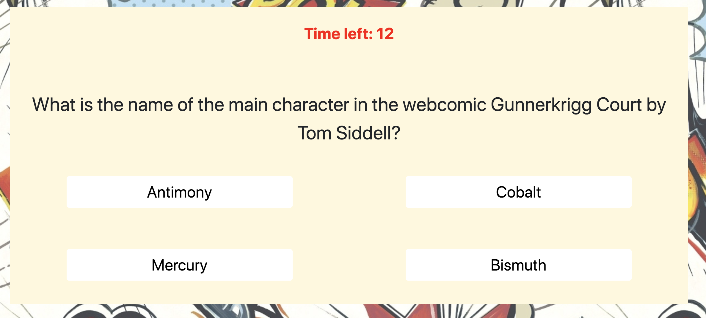

# TriviaGame

This repo holds all the directories and files used in the making of my solution to the 5th homework assignment.

This is a comic book themed trivia game. When the window loads, the user is greeted with a "start game" button. When they click it, they are promped with the first of ten trivia questions, 4 answer choices, and are given 20 seconds to answer the question. If they answer the question correctly, Deadpool gives them a thumbs up and lets them know they got it right. If they answer incorrectly or do not answer by the time allotted, Deadpool gives them a thumbs down and tells them the correct answer. After all 10 questions have been completed, the game shows a final score screen with the player's correct answers, incorrect answers, and unanswered questions. There is a "Play again?" button at the final score screen. If the user clicks it, the trivia game starts again, with all the scores set back to zero.

I used an API to get randomized questions for this homework instead of creating my own question and answer bank.